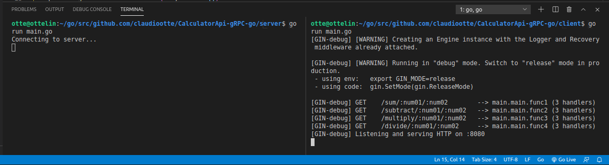
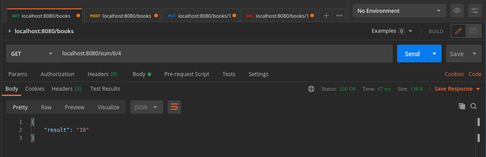
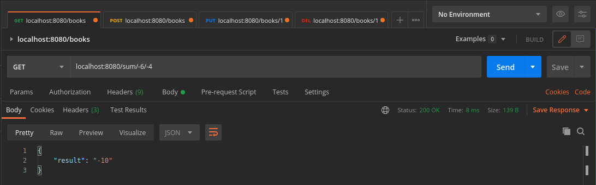
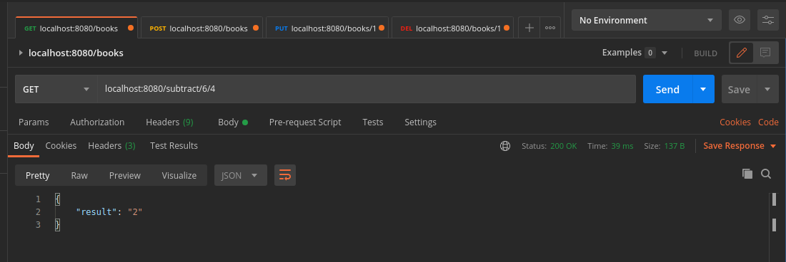
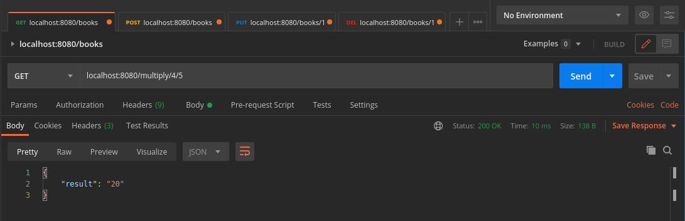
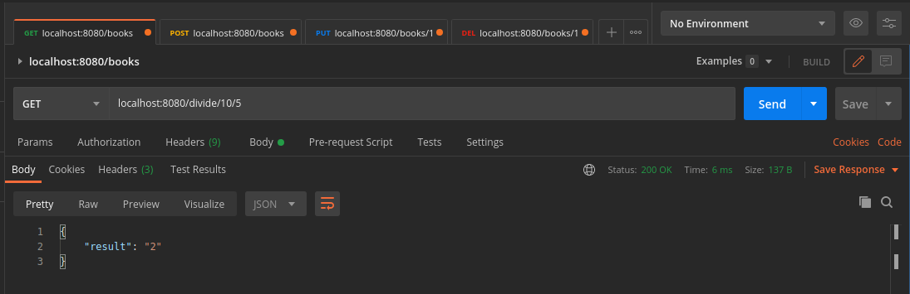

# Calculator API gRPC+Protobuff Golang 
## Calculadora com as principais operaçõe aritméticas utilizando gRPC e Protobuff

<p align="center">
  
</p>


A aplicação foi escrita totalmente em Go 🐹, visando utilizar o mínimo de dependências possíveis, tratar a maioria dos erros com os devidos cuidados e documentada com comentários de fácil entendimento

Pacotes utilizados

- Gin
- gRPC
- Protobuff


## Features

- Na aplicação é possível somar,diminuir,multiplicar e dividir números inteiros


## Na prática

Iniciando a aplicação




Executando a soma





Executando a subtração




Executando a multiplicação




Executando a divisão




## Requisitos

```sh
Golang: https://golang.org/dl/
API Client de sua preferência (O que aparece nas imagens se chama Postman)
```


## Utilização

Basta utilizar o comando go build e aproveitar o aplicativo! 😊
